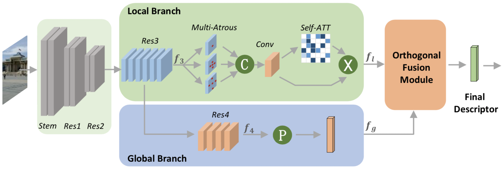

# DOLG in torch and tensorflow (TF2)

Re-implementation (Non Official) of the paper DOLG: Single-Stage Image Retrieval with Deep Orthogonal Fusion of Local and Global Features accepted at ICCV 2021.
[paper](https://arxiv.org/pdf/2108.02927.pdf)

The pytorch checkpoint has been converted into tensorflow format (.h5) from this repository : https://github.com/feymanpriv/DOLG (Official) 

## Pipeline



## Installation 

> pip install opencv-python==4.5.5.64

> pip install huggingface-hub

to install dolg : 

> pip install dolg
OR 
> pip install -e .

## Inference

To do some inference on single sample, you can use python script in examples/ folder or use as follows:

```
import dolg
import numpy as np
from dolg.utils.extraction import process_data

depth = 50

# for pytorch

import torch
from dolg.dolg_model_pt import DOLG
from dolg.resnet_pt import ResNet

backbone = ResNet(depth=depth, num_groups=1, width_per_group=64, bn_eps=1e-5, 
             bn_mom=0.1, trans_fun="bottleneck_transform")
model = DOLG(backbone, s4_dim=2048, s3_dim=1024, s2_dim=512, head_reduction_dim=512,
             with_ma=False, num_classes=None, pretrained=f"r{depth}")
img = process_data("image.jpg", "", mode="pt").unsqueeze(0)

with torch.no_grad():
    output = model(img)
print(output)

# for tensorflow

import tensorflow as tf
from dolg.dolg_model_tf2 import DOLG
from dolg.resnet_tf2 import ResNet


backbone = ResNet(depth=depth, num_groups=1, width_per_group=64, bn_eps=1e-5, 
             bn_mom=0.1, trans_fun="bottleneck_transform", name="globalmodel")
model = DOLG(backbone, s4_dim=2048, s3_dim=1024, s2_dim=512, head_reduction_dim=512,
             with_ma=False, num_classes=None, pretrained=f"r{depth}")
img = process_data("image.jpg", "", mode="tf")
img = np.expand_dims(img, axis=0)
output = model.predict(img)
print(output)
```

## Data 

The model has been trained on google landmark v2. You can find the dataset on the official repository : https://github.com/cvdfoundation/google-landmark .


# Citation : 

```bibtex

@misc{yang2021dolg,
      title={DOLG: Single-Stage Image Retrieval with Deep Orthogonal Fusion of Local and Global Features}, 
      author={Min Yang and Dongliang He and Miao Fan and Baorong Shi and Xuetong Xue and Fu Li and Errui Ding and Jizhou Huang},
      year={2021},
      eprint={2108.02927},
      archivePrefix={arXiv},
      primaryClass={cs.CV}
}


@misc{https://doi.org/10.48550/arxiv.2004.01804,
  doi = {10.48550/ARXIV.2004.01804},
  
  url = {https://arxiv.org/abs/2004.01804},
  
  author = {Weyand, Tobias and Araujo, Andre and Cao, Bingyi and Sim, Jack},
  
  keywords = {Computer Vision and Pattern Recognition (cs.CV), FOS: Computer and information sciences, FOS: Computer and information sciences},
  
  title = {Google Landmarks Dataset v2 -- A Large-Scale Benchmark for Instance-Level Recognition and Retrieval},
```